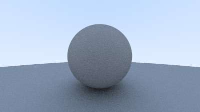
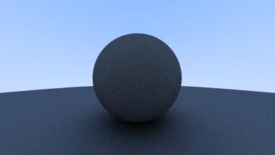
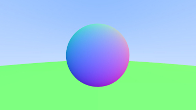

# rayTracerRust
Rust attempt at the 'Ray Tracing In One Weekend' project. Progress is about 2/3 of the first book in the series, achieving a diffuse material lit sphere against a plane.

# Output
The final output from my implementation in rust is the 'gamma corrected sphere':

Some previous stages include the first antialiased diffuse sphere:

The antialiased sphere with colour added to normals:

# To Run
To run the project, cd into the ray\_tracer directory and run 'cargo run > output.ppm'.
